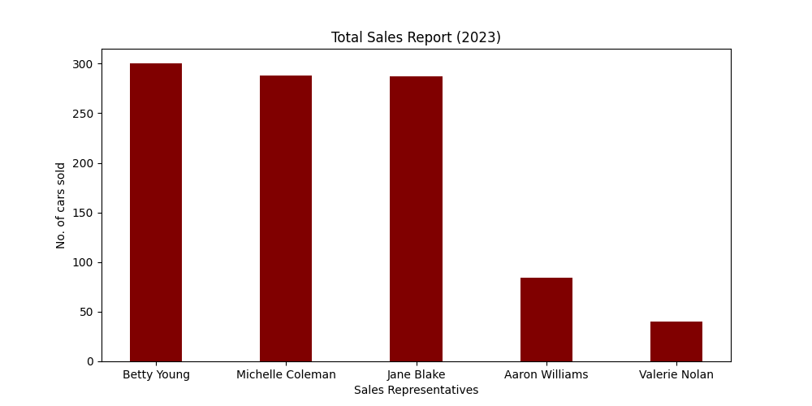
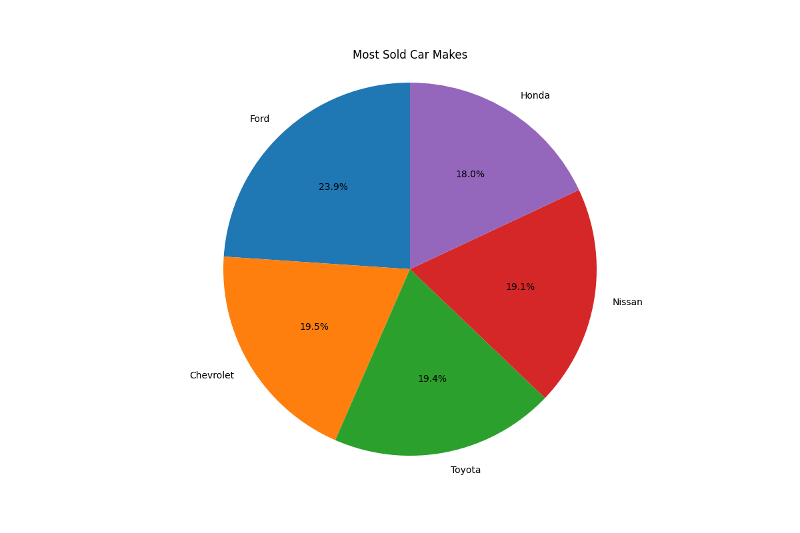
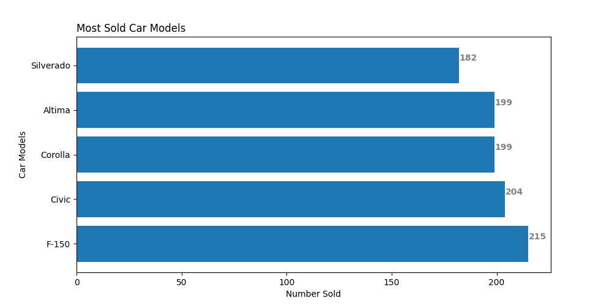

[][def]

# Mini Project Week 9

## The current implementation of the mini project can be executed as follows:

1. All dependencies needed for execution can be found in the [requirement.txt](https://github.com/nogibjj/oo46_iProject_1/blob/main/requirements.txt) file
2. These dependencies will be installed by github actions using the Make file.

## Mini deliverables:

1. [Jupyter Notebook](https://github.com/nogibjj/oo46_iProject_1/blob/main/notebook.ipynb) with:

- Cells that perform descriptive statistics using Pandas.
- Tested by using nbval plugin for pytest

- Run all tests (must test notebook and script and lib)
- Formats code with Python black
- Lints code with Ruff
- Installs code via: pip install -r [requirements.txt](https://github.com/nogibjj/oo46_iProject_1/blob/main/requirements.txt)

<!-- 5. [test_script.py](https://github.com/nogibjj/oo46_Mini_Proj_W9/blob/main/test_script.py) to test script
6. [test_lib.py](https://github.com/nogibjj/oo46_Mini_Proj_W9/blob/main/test_lib.py) to test some library functions -->
7. GitHub Actions performs all four Makefile commands with badges for
   each one in the README.md

## Statistics Analysis

### Top Sales Report by sales persons from the car sales dataset

### Top Sales Report by car make from the car sales dataset

### Top Sales Report by car model from the car sales dataset

[def]: https://https://github.com/nogibjj/oo46_iProject_1/actions/workflows/actions.yml
