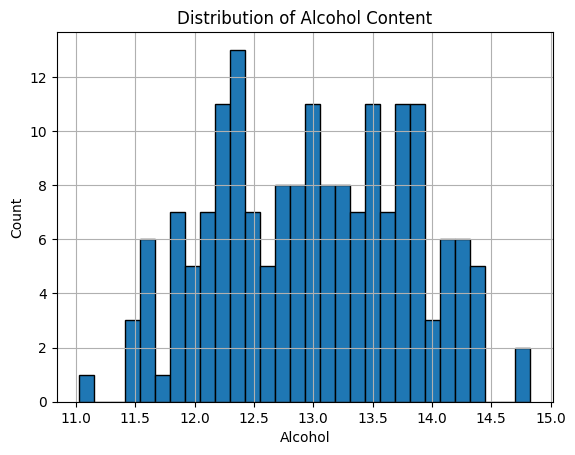
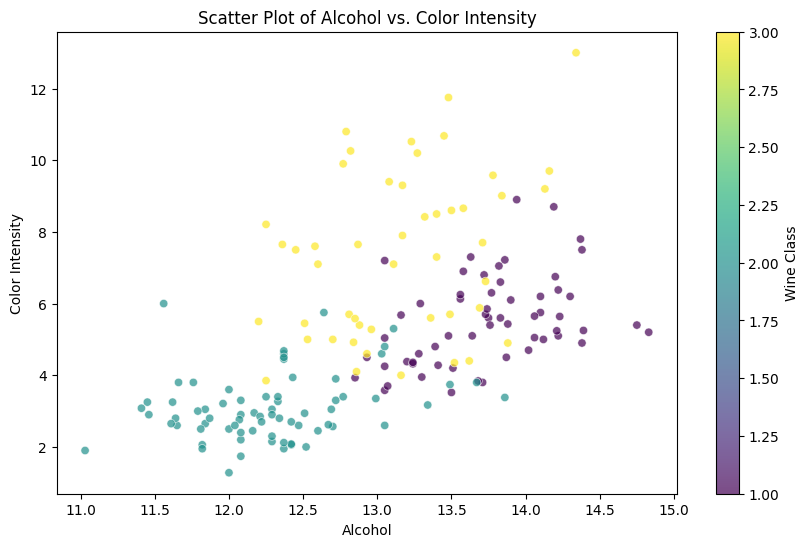

[][def]

# Mini Project Week 9

## Projet Scope:
This project sets up a [cloud-hosted notebook](https://colab.research.google.com/drive/1dWTQFWUPjORLF0nVZJzGHamJwm-L8rq0?usp=sharing) and demonstrates data manipulation with a sample dataset.

# Mini Deliverables:

1. [Jupyter Notebook](https://github.com/nogibjj/oo46_Mini_Proj_W9/blob/main//week_9_mini_project.ipynb)

2. [Sample Dataset](https://archive.ics.uci.edu/ml/machine-learning-databases/wine/wine.data")

## Data Visualization Output

### A a histogram of Alcohol content:

### Bar Plot of Average Alcohol Content by Wine Class:

### Scatter Plot of Alcohol vs. Color Intensity:

[def]: https://https://github.com/nogibjj/oo46_iProject_1/actions/workflows/actions.yml
